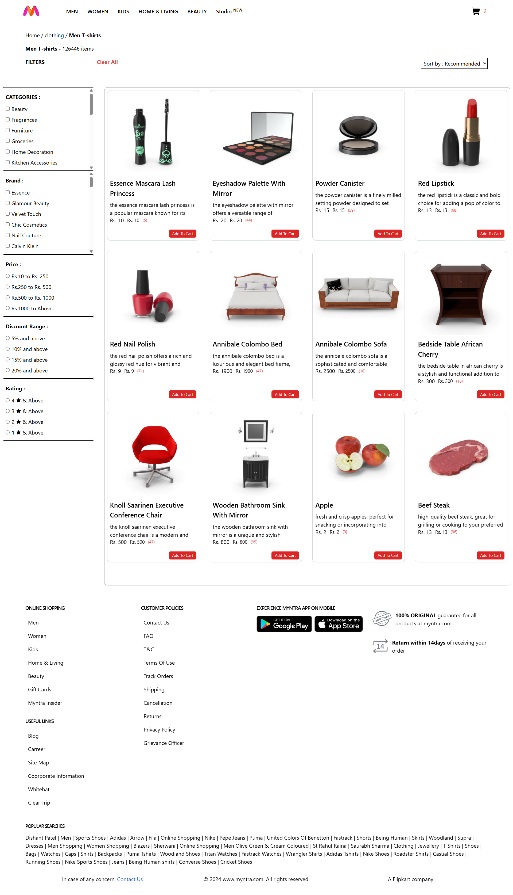
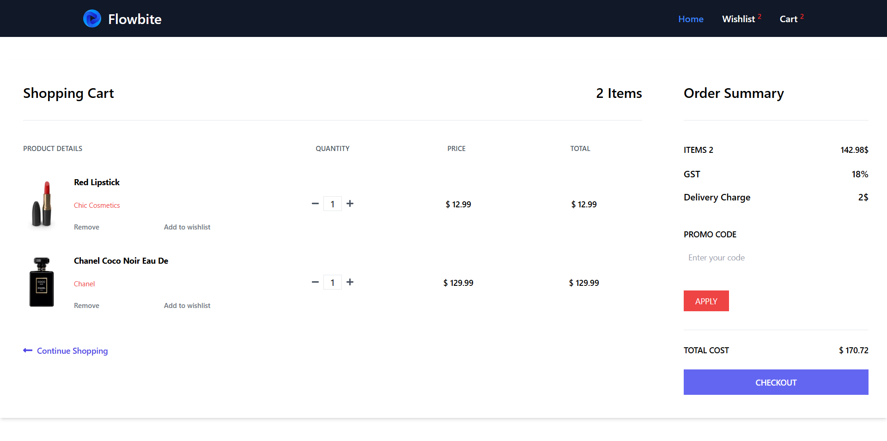
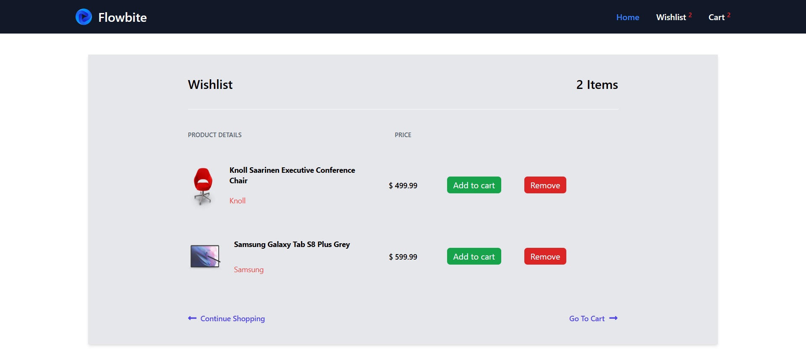
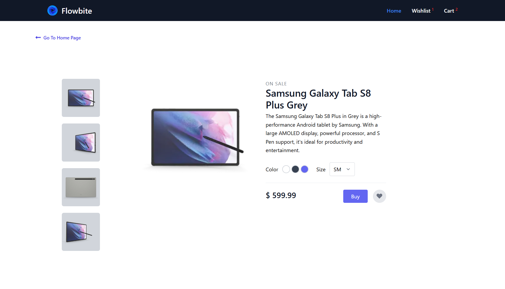

# E-Commerce Web Application

A modern e-commerce web application built with **JavaScript/React/Node.js** (adjust according to your tech stack). This app fetches products from an API and includes features like product filtering, wishlist, and cart management.

---

## 🌐 Live Demo
You can check the live project here 👉 https://ecommerce-using-react-two.vercel.app/

---

## Features

- **Product Listing:** Fetches products dynamically from an external API.
- **Product Filters:** Filter products by category, price, rating, etc.
- **Wishlist Management:** Add/remove products to your wishlist.
- **Cart Management:** Add/remove products from the cart and view total price.
- **Responsive Design:** Works seamlessly on desktop and mobile devices.

---

## Tech Stack

- Frontend: HTML, CSS, JavaScript and React.js
- API: External product API
- Package Manager: npm 

---

## 🚀 Getting Started

## 1️⃣ Clone the repository

git clone https://github.com/kuldeep464/ecommerce_using_React.git

## 2️⃣ Navigate to the project folder

cd ecommerce_using_React

## 3️⃣ Install dependencies

npm install

## 4️⃣ Run the development server

npm run dev

## 📜 License

This project is for educational purposes only and is not intended for commercial use.